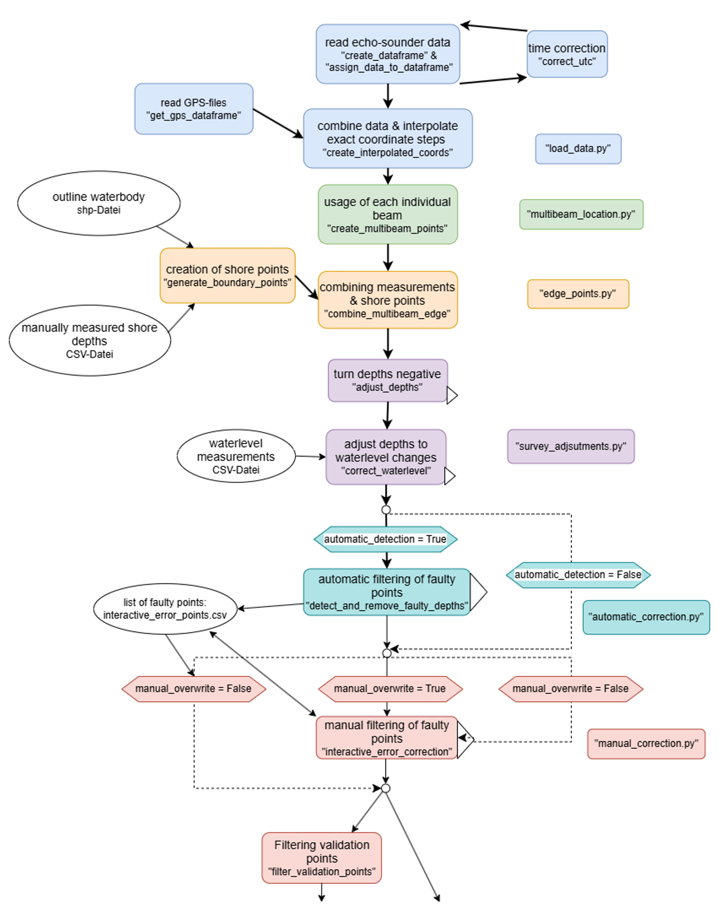

# Script to process data from the Riversurveyor M9 echo-sounder to optimize for bathymetric mapping. #
No map interpolation is included.
The survey is expected to be done with an additional RTK-GNSS (specifically the Pro Nivo PNR21) but can be adapted to work with a different or without a seperate GNSS.
The RiverSurveyor M9 (RS) data is expected as the result of the RiverSurveyor Live-Software Export in matlab and ASCII format.

General functionality, combined in main.py:

- The echo-sounder data gets linked with the GNSS data and is corrected for faulty data and differences in the recording times (load_data.py).

- To achieve maximum data richness, each depth-beam of the RS gets geolocated individually instead of using it combined in "Bottom Track". (multibeam_location.py)

- In order to optimally include the bank areas of the waterbody in the interpolation, measurements of the bank can be entered, from which points along the bank are created.
Alternativly an general depth of 0m at the bank can be assumed.
Waterlevel changes from different survey dates can be corrected in the data, based on waterlevel measurements. (survey_adjustments.py)

- To optimal filter the echo sounder data for faulty measurements, two detection variants are implemented:
The autoamtic filtering, checks each point based on the mean of all sourrounding points (based on user defined variables). (automatic_detection.py)

- The manual filtering opens each survey as a individual plot, for the user to mark or unmark faulty points by hand. (manual_correction.py)
In order to validate the interpolation quality, points can be filtered out at regular variable intervals to create a validation and interpolation data set.

---
##Additional functionalitys not included in main.py:##
- A themperature profile and average temperature for the water column can be calculated based on manual temperature measuremnts  e.g. to use for manual temperature correction in the RiverSurveyor Live Software, as an alternative to CTD-probes. (temperature_plot.py)

- To validate the measuring consistency of the RS-data, close points within a variable distance as well as with a time and space difference get compared and the differences displayed in boxplots. (QC_point_consistency.py)

---
(all functions are expected to be in the same folder)  
(All CSV and shp files must be stored individually in separate folders, i.e. without other files of the same type.)

---
Setup: 

---
main.py flowchart:

