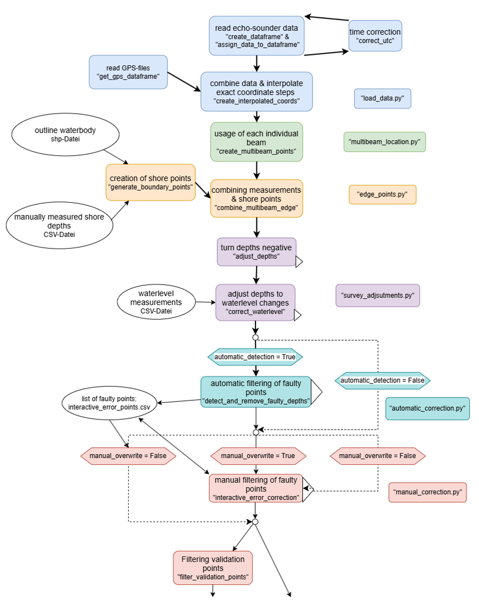

# Method for bathymetric mapping with the Sontek RiverSurveyor M9 on the example of Lake Caputh

The Sontek Riversurveyor M9 is a powerfull tool to measure flow velocity and discharge. 
Physically identical to the related Hydrosurveyor M9, it also has good prerequisites for bathymetric mapping.  
This project aims to utilize the Riversurveyor's full potential for bathymetric mapping, outside of the HYPACK MAX software.

It was created as part of my bachelor thesis on the bathymetric mapping of Lake Caputh (Brandenburg, Germany).


**more info at the [docs](/docs/main_docu.md)**

## Table of contents
- [Functionality](#functionality)
- [Requirements](#requirements)
- [Quickstart](#quickstart)
- [How to use this project](#how-to-use-this-project)
- [Overview](#overview)

## Functionality
This project can be used to achieve a higher precision and richness of Riversurveyor M9 data especially combined with an seperate RTK-GNSS (in particular the ProNivo PNR21).
The Code combines the GNS and echo-sounder data and allows for for the use of each depth-beam measurement individually - just like the Hydrosurveyor.  
Water level fluctuations between different survey days will be corrected based on level measurements.  
To allow for higher measurement coverage, manual depth measurements along the shore can be used to create uniformly distributed depths along the shoreline.
Two filtering methods give full controle over your data quality.  
The point consistency can be tested as a measure of the recording consistency and filter quality.
To verify the seperate interpolation for a bathymetric map, variable validation datasets can be created.

Based on seperate temperature measurments, temperature stratification of the waterbody can be analyzed, e.g. to use as manual temperature correction in the RiverSurveyor Live Software as an alternative to a CTD-probe.


Tested on Python 3.11  
Tested on Windows (x86), MacOS (ARM), Linux (x86)
## Requirements

**required python packages:** (as provided by requirements .txt)
- pandas
- geopandas
- shapely
- numpy
- pymatreader
- scipy
- tqdm
- matplotlib


**Exemplary structure of the data dir:**  
Save your data in the according files.
Dataformat specified at [docs](/docs/needed_data.md)

```
data
├───gps_data        .txt's of external GNSS data
├───outline         .csv of shore depths
│   └───others      place for other shore depth variants
├───shp_files       .shp of the waterbody
├───sonar_data      .sum's & .mat's of the RiverSurveyor data
├───temperature     .csv of temperature measurements (one per day)
└───waterlevel      .csv of waterlevel measurements
```


## Quickstart
Install packages from requirements.txt, preferable with conda (and the conda-forge channel)


Go to `src` (`cd src`)
### Full bathymetric data processing
For full bathymetric data processing, run:
```bash
python main.py
```
To skip the manual filtering, run:
```bash
python main.py --manual_correction_overwrite
```
To skip the automatic filtering, run:
```bash
python main.py --automatic_detection
```
To apply an existing filter-list without overwriting it, run:
```bash
python main.py --automatic_detection --manual_correction_overwrite
```

for further options, see [docs](/docs/main_docu.md#options)
### Quality Controle
To controle the data-point consistency run:
```
python QC_point_consistency.py
```
for further options, see [docs](/docs/QC_docu.md#options)
### Temperature stratification
To analyze temperature stratification, run:
```
python temperature_plot.py
```
for further options, see [docs](/docs/temp_plot_docu.md#options)

## How to use this project

### Options for bathymetric processing (main.py)
#### Automatic Filtering
To disable automatic filtering, set:
```
--automatic_detection
```
To change the parameters [m], which will be applied to select faulty points, use:
```
--filtering_max_distance X
```
```
--filtering_threshold X
```
for further details, see [docs](/docs/main_docu.md#automatic-filtering)

#### Manual Filtering
To only show plots when no filter list of earlier filtering exists, use:
```
--manual_correction_overwrite
```
for further details, see [docs](/docs/main_docu.md#manual-filtering)

#### Waterlevel Corrections
To specify the day to whose water level all measurements are referenced, use:
```
--level_reference_date MM/DD/YYYY
```
Otherwise the best fitting will be automatically applied and shown.
For further details, see [docs](/docs/main_docu.md#waterlevel-corrections)

#### Shore-points
To not use depth measurments from the shore line but to create points of 0m depth instead, use:
```
--edge_points_zero
```
for further details, see [docs](/docs/main_docu.md#shore-points)

#### Create Validation dataset
To change the interval for assignment to the validation dataset, use (every Xth point will be assigned to val-dataset):
```
--validation_sample_rate X
```

To disable creation of an validation dataset, set:
```
--skip_validation_sampling
```
for further details, see [docs](/docs/main_docu.md#create-validation-dataset)


### Options for controle of Point Consistency 
Seperate scrpit: `QC_point_consistency.py`

To change parameters taht determine which points are getting compared, use:
How close points have to be, to be compared [in meters]:
```
--matching_radius X
```
Minimal time difference between points to be compared [in minutes]:
```
--min_time_diff X
```
for further details, see [docs](/docs/QC_docu.md#)

### Options for temperature stratification
No basic changes are needed, for further details, see [docs](/docs/temp_plot_docu.md)

## Overview
main.py flowchart:

